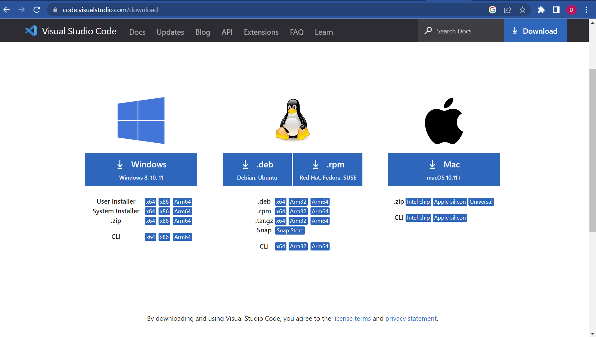

Hey y'all. Today we're gonna be doing some cool hackermans stuff.

A) Installing VScode

B) Remotely Connecting

C) Trying Some Commands

# PART A| Installing Microsoft malware

To install on vscode, click on this here link: https://code.visualstudio.com/download

You should land on a page that looks like this:
 

Select either Mac or Windows because if you're putting up with Linux, you don't need my help :)

Go ahead and run the installer.exe that spawned into your downloads folder. Just speedrun through the installer and make sure to skip all the parts that ask if you'd like to install a free trial of microsoft office /j. Anyways you'll know you've done it correctly after you land at an application window that looks like this:

Congrats, you now have successfully installed vscode. And you have my blessing to move onto the next part

# PART B| ssh Time

If you have a Windows machine install gitbash here: https://gitforwindows.org/
If you have a Mac, you're in the clear
If you have a Linux machine, I can't help you :)

To remotely connect, open your terminal in VScode. [Note: for me, I couldn't connect because for some reason my previous VScode installation broke the ssh command, but switching to raw command prompt made it run. YMMV]

# Part C| Hacking into the mainframe

